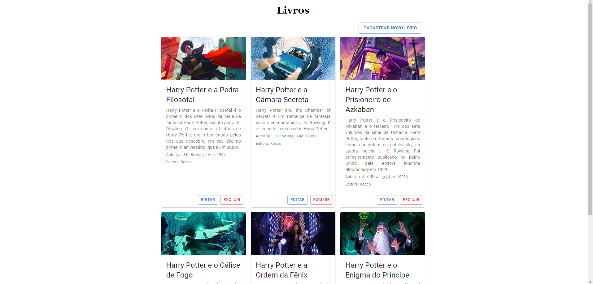
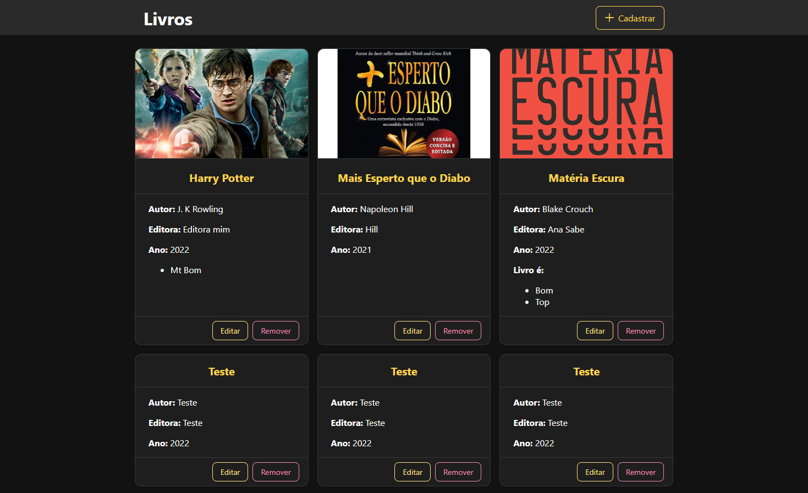
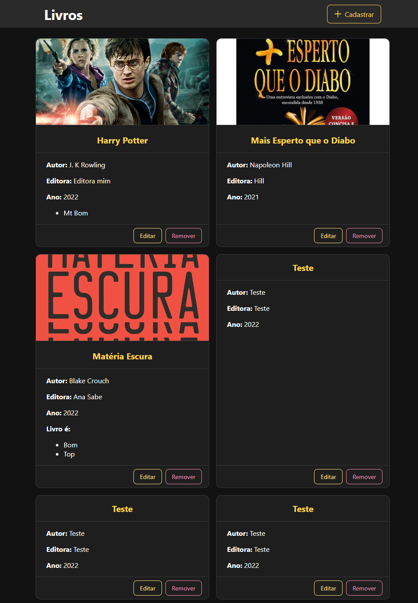
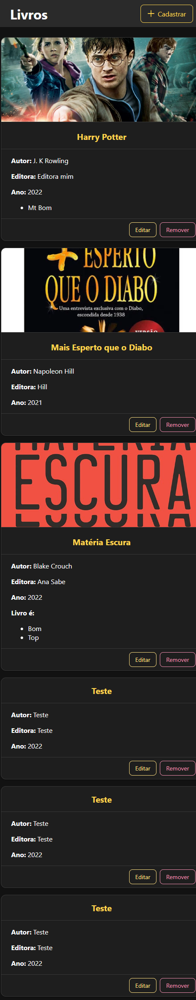
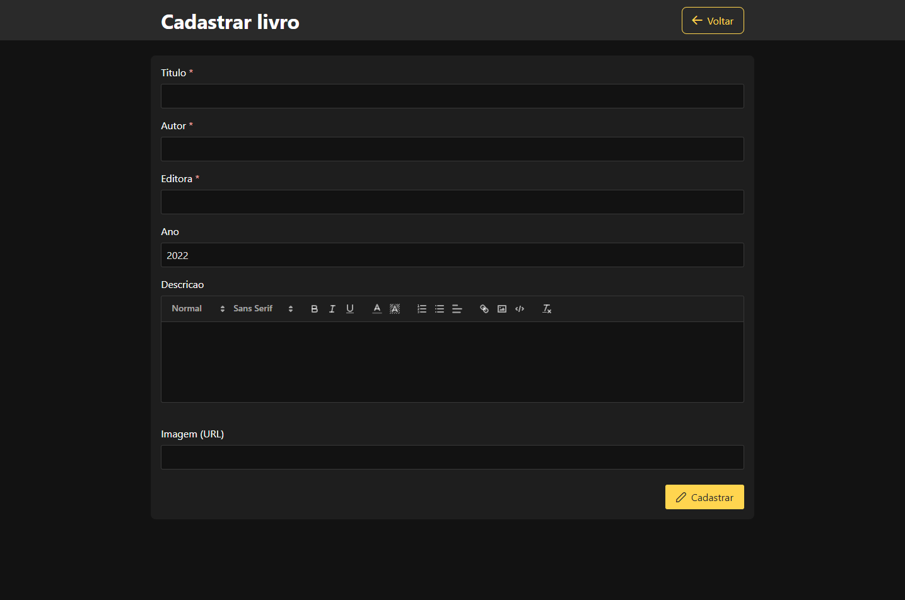
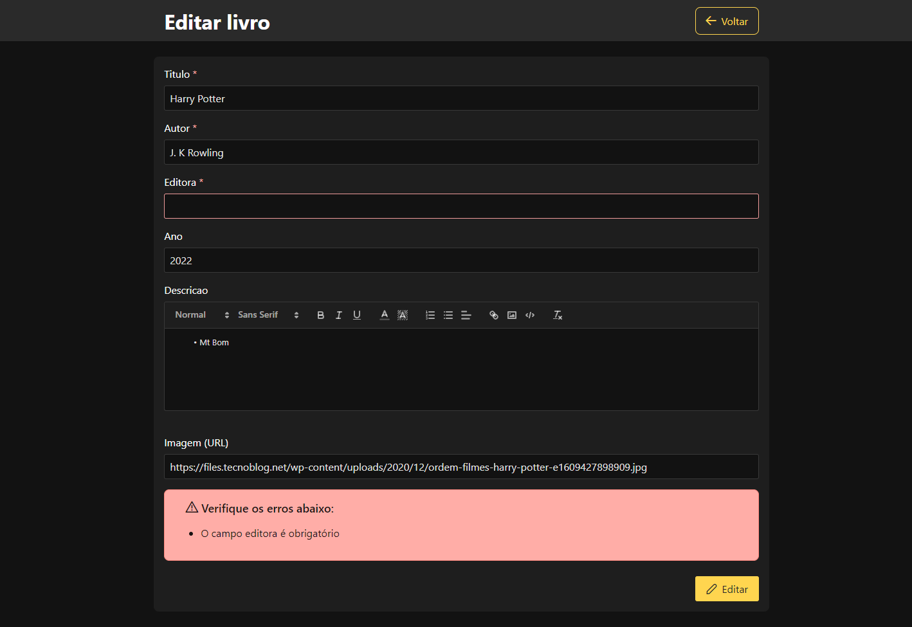
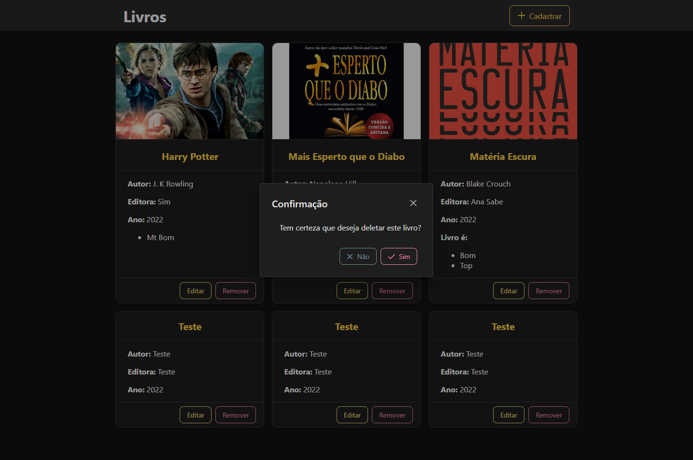

# Instruções para rodar o projeto

## Sobre o projeto
Crud de livros desenvolvido em Typescript com o framework NestJS, ReactJS/Angular no frontend e banco de dados MySQL.

## Pre-requisitos
- MySQL
- NodeJS
- NPM

## Autores
- [Bruno Marlon Schmidt](https://github.com/BrunoMSchmidt)
- [Ana Luiza Epping](https://github.com/Ana-Epping)

---
## Configuração do banco de dados
### 1ª Opção
- Criar um banco de dados chamado `crudlivros`
- Criar um usuário chamado `novo` com senha `1234` e dar permissão de acesso ao banco de dados `crudlivros` (Ou permissão total)

### 2ª Opção
- Criar um banco de dados, usuario e senha de sua preferência
- Alterar o arquivo `backend/src/config/dbconfig.ts` com as informações do banco de dados criado

---

##### O NestJS irá criar as tabelas automaticamente

---

## 1 - Instalar as dependências
A partir da raiz:
```bash
cd backend
npm install
```
```bash
cd frontend-react
npm install
```
```bash
cd frontend-angular
npm install
```

## 2 - Rodando o Backend
```bash
cd backend
npm start
```
O backend estará rodando na porta 4000


## 3 - Rodando o Frontend React
```bash
cd frontend-react
npm run dev
```
O frontend em react estará rodando na porta 3000
Acesse o frontend em react no seu browser em http://localhost:3000

### Imagens do frontend em React
#### Desktop


#### Tablet


#### Mobile


## 4 - Rodando o Frontend Angular

Caso tenha a CLI do angular instalada:
```bash
cd frontend-angular
ng s
```

Caso não tenha:
```bash
cd frontend-angular
npm run ng s
```
___
O frontend em angular estará rodando na porta 4200
Acesse o frontend em angular no seu browser em http://localhost:4200

### Imagens do frontend em Angular

#### Desktop


#### Tablet


#### Mobile


#### Cadastro


#### Edição


#### Exclusão


## Divirta-se!


