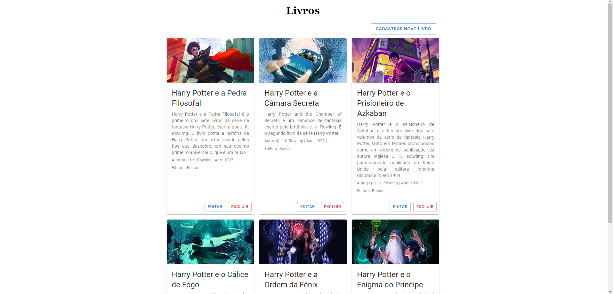

# Instruções para rodar o projeto

## Sobre o projeto
Crud de livros desenvolvido em Typescript com o framework NestJS, ReactJS no frontend e banco de dados MySQL.

## Pre-requisitos
- MySQL
- NodeJS
- NPM

## Autores
- [Bruno Marlon Schmidt](https://github.com/BrunoMSchmidt)
- [Ana Luiza Epping](https://github.com/Ana-Epping)

---
## Configuração do banco de dados
### 1ª Opção
- Criar um banco de dados chamado `crudlivros`
- Criar um usuário chamado `novo` com senha `1234` e dar permissão de acesso ao banco de dados `crudlivros` (Ou permissão total)

### 2ª Opção
- Criar um banco de dados, usuario e senha de sua preferência
- Alterar o arquivo `backend/src/config/dbconfig.ts` com as informações do banco de dados criado

---

##### O NestJS irá criar as tabelas automaticamente

---

## 1 - Instalar as dependências
```
cd backend
npm install
```
```
cd frontend
npm install
```

## 2 - Rodar o projeto
Em dois terminais diferentes, execute os seguintes comandos a partir da raiz do projeto:
```
cd backend
npm start
```
```
cd frontend
npm run dev
```

## 3 - Acessar o projeto
Acesse o projeto em `http://localhost:3000`

## Divirta-se!

___

# Imagens do projeto

## Desktop


## Tablet


## Mobile

